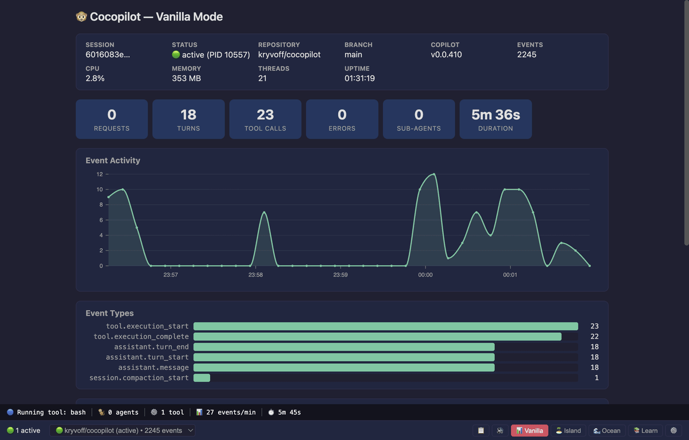
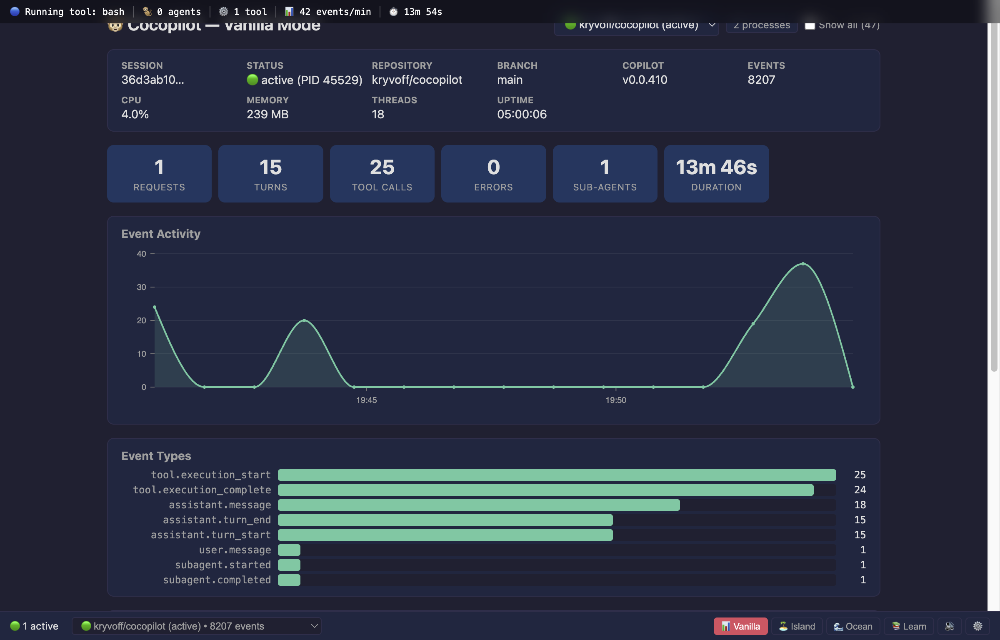
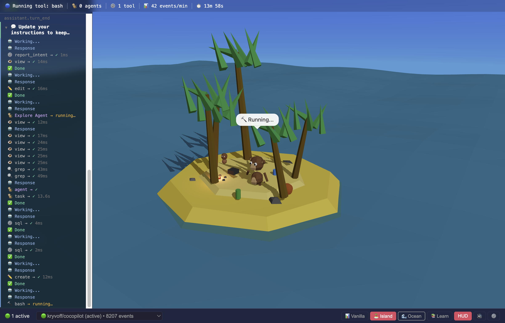
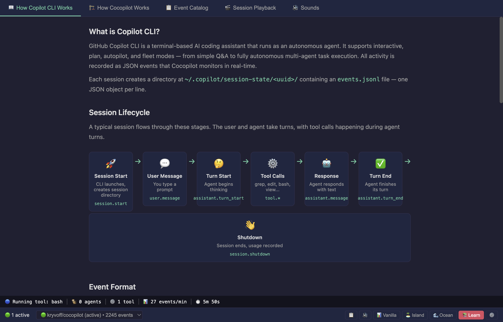
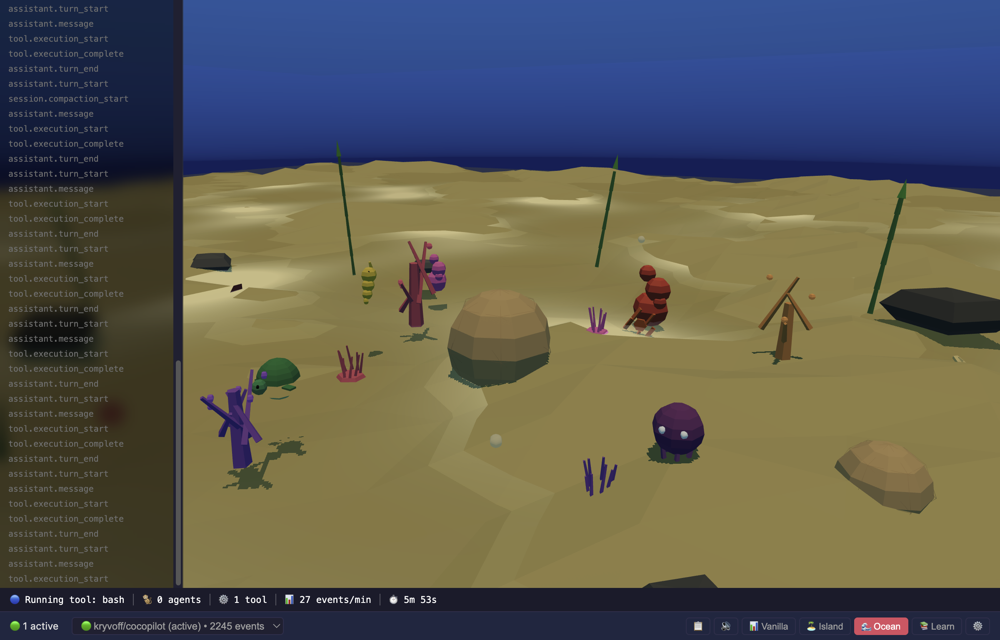

# 🐵 Cocopilot — Coco the Copilot for Copilot!

> **A fun desktop companion that watches your GitHub Copilot CLI sessions and brings them to life with dashboards, 3D scenes, and sound!**

**v0.6** · [](https://github.com/kryvoff/cocopilot/actions/workflows/ci.yml)



## 🎉 What is this?

Cocopilot is a **Sunday vibe coding experiment** born from the pure joy of exploring [GitHub Copilot CLI](https://docs.github.com/en/copilot/copilot-cli) features — especially **autopilot mode** and **fleet (sub-agents)**! We wanted to understand how Copilot CLI actually works under the hood, and what better way than to build a fun monitoring app that visualizes every event, tool call, and token in real time?

This project is our entry for the [GitHub Challenge on DEV.to](https://dev.to/challenges/github-2026-01-21) 🏆

**The best part?** This entire app — every single line — was written *by* Copilot CLI (Claude Opus 4.6 model), *about* Copilot CLI. The human wrote zero code — just guided the AI. It's copilots all the way down! 🐒

## ✨ Features

### 📊 Vanilla Mode (v0.1)



- **Live event timeline** — watch every Copilot CLI event as it happens
- **Session info** — repository, branch, model, version at a glance
- **Stats cards** — requests, turns, tool calls, errors, sub-agents, duration
- **Activity chart** — Nivo line chart showing event activity over time
- **Event type distribution** — bar chart of event types
- **Session filtering** — active sessions shown by default, toggle to see all history
- **SQLite persistence** — sessions and events persist across restarts
- **Schema resilience** — gracefully handles unknown event types as Copilot evolves
- **Debug API** — `localhost:9876` endpoint for agent-driven verification
- **CLI check** — `npm run check` validates schema compatibility

### 🏝️ Island Mode (v0.2)



A 3D tropical island where **Coco the monkey** 🐵 reacts to your coding session:
- Procedural low-poly monkey with 7 animation states
- Speech bubbles showing current activity (✏️ Editing..., 🔍 Searching...)
- Sub-agent monkeys jump in from the left, exit to the right
- Tool objects (typewriter, binoculars, coconut, bottle) glow when active
- Animated ocean waves respond to activity level — calm when idle, stormy when busy
- Drifting clouds, palm trees, campfire, decorations
- Git-like event log panel with collapsible user message groups

### 📚 Learn Mode (v0.2.5)



Interactive tutorials that explain how Copilot CLI works — 4 tabs:
- **Tutorial** — visual session lifecycle, autopilot/fleet/plan modes, key concepts
- **Architecture** — how Cocopilot works: data pipeline, process monitor, debug API
- **Event Catalog** — 18 event types with descriptions, data fields, example JSON
- **Session Playback** — replay synthetic sessions with speed control (1x/2x/5x/10x) and annotations

### 🌊 Ocean Mode (v0.3)



A deep underwater world with **Flipper the dolphin** 🐬:
- Procedural dolphin with 8 animation states (swimming, diving, jumping...)
- Coral reef with branching corals, brain corals, and waving anemones
- Ocean creatures: octopus (bash), seahorse (edit), starfish (search), sea turtle (view)
- Fish schools for sub-agents, jellyfish for errors, bubble effects
- Swaying seaweed, scattered rocks, animated sun rays with god ray cones

### 🔊 Sound System

11 procedurally generated sounds — all synthesized via Python, no external audio assets:

| Sound          | Duration | Used For                              |
|----------------|----------|---------------------------------------|
| ambient-island | 30s loop | Island mode background (waves + bird) |
| ambient-ocean  | 16s loop | Ocean mode background (rumble + bubbles) |
| monkey-call    | 1.5s     | Session start (Island)                |
| dolphin-call   | 0.8s     | Session start (Ocean)                 |
| bubble         | 0.2s     | Bubble effects                        |
| chime          | 1.2s     | User message / notification           |
| typewriter     | 1.5s     | Edit/create tool execution            |
| coconut-crack  | 0.8s     | Bash tool execution                   |
| error          | 0.6s     | Tool execution failure                |
| success        | 0.8s     | Tool success / turn end               |
| goodbye        | 2.5s     | Session shutdown                      |

See [`docs/09-sounds.md`](docs/09-sounds.md) for synthesis details, spectrograms, and regeneration instructions.

### 🎯 Across All Modes

- **Activity Bar** — bottom bar (above Status Bar) showing agent state, sub-agent count, tool count, event rate, session duration
- **Status Bar** — bottom bar with session selector, Events toggle (📋), Sound toggle (🔊/🔇), mode tabs, settings gear
- **Settings page** — full-screen settings with mode selector, audio controls, monitoring info, about section
- **Session selector** — switch between copilot sessions from the status bar dropdown
- **Process monitoring** — tracks copilot CLI processes with CPU%, memory, threads
- **Session playback** — replay synthetic sessions for testing and demos

## 🚀 Quick Start

### Prerequisites
- [Node.js](https://nodejs.org/) 22+ (LTS recommended)
- [GitHub Copilot CLI](https://docs.github.com/en/copilot/copilot-cli) installed and used at least once

### Install & Run

```bash
# Clone the repo
git clone https://github.com/kryvoff/cocopilot.git
cd cocopilot

# Install dependencies
npm install

# Start the app in dev mode (with hot reload!)
npm run dev
```

That's it! 🎉 The app will start monitoring your `~/.copilot/session-state/` directory. Open a terminal, start a Copilot CLI session (`copilot`), and watch Cocopilot light up!

### Check Schema Compatibility

```bash
# Scan your copilot sessions and check for unknown event types
npm run check
```

This runs the standalone `cocopilot check` CLI that inspects your `~/.copilot/session-state/`, parses all events, and reports whether the schemas are compatible.

### Build for Production

```bash
# Build the app
npm run build

# Preview the production build
npm run preview

# Package as a distributable (.dmg / .exe / .AppImage)
npm run build && npx electron-builder
```

### Install Stable + Dev Side-by-Side

You can run both a stable installed version and a dev version simultaneously:

```bash
# Build and install a stable version
npm run build && npx electron-builder
# Install the .dmg (macOS) / .exe (Windows) / .AppImage (Linux)
# The installed app uses its own data directory

# Run the dev version alongside it
npm run dev
# Dev uses the same ~/.copilot/ monitoring but separate app data
```

The installed app and dev version run independently — different Electron processes, different app data directories. They both monitor the same `~/.copilot/session-state/` (read-only), so you can have the stable version running while developing.

### npm Scripts

| Script                | Description                                              |
|-----------------------|----------------------------------------------------------|
| `npm run dev`         | Start app in dev mode with hot reload                    |
| `npm run build`       | Production build via electron-vite                       |
| `npm run preview`     | Preview the production build                             |
| `npm run typecheck`   | TypeScript type checking (node + web)                    |
| `npm run lint`        | ESLint with auto-fix                                     |
| `npm run test:unit`   | Unit tests with Vitest (226 tests)                       |
| `npm run test:e2e`    | E2E tests with Playwright (launches app, visual regression) |
| `npm run test:e2e:update` | Update visual regression screenshot baselines        |
| `npm run test:smoke`  | Build + launch app + verify debug server responds        |
| `npm run check`       | Scan copilot sessions for schema compatibility           |

> **Note:** E2E tests use Playwright with Electron. They launch the app at a fixed 1200×800 window (1x scale factor) for deterministic screenshots. Run `npm run test:e2e:update` after visual changes to update baselines.

## 🏗️ How It Works

Cocopilot is a **read-only, local-only** Electron app that:

1. **Watches** `~/.copilot/session-state/` for `events.jsonl` files
2. **Parses** each event using [Zod](https://zod.dev/) schemas with `safeParse` — never crashes on unknown events!
3. **Displays** the events in real-time through the active mode (Vanilla, Island, Learn, or Ocean)

```
~/.copilot/session-state/*/events.jsonl
        ↓
  FileWatcher (chokidar)
        ↓
  EventParser (Zod safeParse — resilient to schema changes!)
        ↓
  SessionStore → IPC → React UI (Zustand)
        ↓
  📊 Vanilla | 🏝️ Island | 📚 Learn | 🌊 Ocean
```

### Privacy & Security

- **Read-only** — we never write to `~/.copilot/` or interact with Copilot processes
- **Local-only** — zero network calls, no telemetry, no cloud
- **Sandboxed** — Electron renderer runs with `sandbox: true` and `contextIsolation: true`

## 🧪 100% Built by Copilot

**Every single line of code in this project was written by GitHub Copilot CLI**, primarily using the **Claude Opus 4.6** model. The human's role was providing direction, reviewing output, and clicking "accept" — zero manual coding!

We're using:

- **Copilot CLI interactive mode** — for regular development
- **Autopilot mode** — for autonomous multi-file changes
- **Fleet (sub-agents)** — for parallel tasks like tests + implementation
- **Plan mode** — for architecture and design

The meta-beauty: a copilot monitoring app, built by copilot, monitored by itself! 🤯

## 🛠️ Tech Stack

| Component         | Technology                       |
|-------------------|----------------------------------|
| Framework         | Electron 40 + electron-vite 5   |
| Language          | TypeScript 5.7                   |
| UI                | React 19 + Zustand 5            |
| Schema Validation | Zod 4 (resilient parsing)        |
| Charts            | Nivo (line + bar)                |
| 3D                | Three.js + @react-three/fiber + drei |
| Audio             | Howler.js (11 synthesized sounds) |
| Database          | SQLite (better-sqlite3)          |
| File Watching     | Chokidar                         |
| Testing           | Vitest 4 + Playwright            |
| CI/CD             | GitHub Actions (3 OS)            |

## 📁 Project Structure

```
src/
├── main/              # Electron main process
│   ├── monitoring/    # File watcher, event parser, session store
│   ├── database/      # SQLite schema and queries
│   ├── cli/           # Standalone CLI commands (cocopilot check)
│   ├── ipc/           # IPC handlers
│   └── observability/ # Debug HTTP server (:9876)
├── preload/           # Secure context bridge
├── renderer/          # React UI
│   ├── modes/         # Vanilla, Island, Learn, Ocean
│   ├── audio/         # AudioManager, event-sound mapping, hooks
│   ├── store/         # Zustand stores (app-store, monitoring-store)
│   └── components/    # ActivityBar, StatusBar, SettingsPanel
└── shared/            # Types, IPC channels, config

docs/                  # Specifications and design docs (01–10)
resources/audio/       # Generated MP3 sounds + Python generators
scripts/               # smoke-test.sh, capture-screenshots.sh
test/
├── unit/              # 226 Vitest tests (15 test files)
├── e2e/               # Playwright E2E + visual regression
└── fixtures/          # JSONL event fixtures for testing
```

## 📚 Documentation

| Doc                                              | Description                              |
|--------------------------------------------------|------------------------------------------|
| [`docs/01-copilot-cli-internals.md`](docs/01-copilot-cli-internals.md)   | Copilot CLI event types and structure    |
| [`docs/02-electron-app-architecture.md`](docs/02-electron-app-architecture.md) | App architecture and process model  |
| [`docs/03-monitoring-data-model.md`](docs/03-monitoring-data-model.md)   | Data model and schema resilience         |
| [`docs/04-visual-modes-scenes.md`](docs/04-visual-modes-scenes.md)     | Visual modes and 3D scene design         |
| [`docs/05-testing-strategy.md`](docs/05-testing-strategy.md)           | Testing pyramid and observability        |
| [`docs/06-ci-cd-release.md`](docs/06-ci-cd-release.md)                 | CI/CD workflows and release pipeline     |
| [`docs/07-decisions-log.md`](docs/07-decisions-log.md)                 | Architecture decisions log               |
| [`docs/08-future-ideas.md`](docs/08-future-ideas.md)                   | Future ideas and feature backlog         |
| [`docs/09-sounds.md`](docs/09-sounds.md)                               | Sound synthesis and audio system         |
| [`docs/10-copilot-self-review.md`](docs/10-copilot-self-review.md)     | Project review and v1.0 recommendations  |
| [`docs/11-dev-usage-summary.md`](docs/11-dev-usage-summary.md)        | Development session metrics and cost      |
| [`docs/progress.md`](docs/progress.md)                                 | Development progress tracker             |

## 🤝 Contributing

This is a **vibe coding experiment** — a weekend project built entirely by AI in a single day. It's not actively maintained and is unlikely to see continued development.

**What this means:**
- 🍴 **Fork it!** If you want to add features or take it in a different direction, please fork the repo and go for it. No need to ask permission — it's MIT licensed.
- 🐛 **Bug fixes welcome** — if you find something broken (especially on Windows or Linux, which weren't tested), small fix PRs are welcome and will be reviewed.
- 💬 **Issues are fine** — feel free to report bugs or share ideas, but don't expect them to be acted on quickly.
- ❌ **Large PRs likely won't be merged** — if you have big ideas, fork and build! That's the spirit of open source.

## 📊 Development Stats

See [`docs/11-dev-usage-summary.md`](docs/11-dev-usage-summary.md) for detailed session metrics, cost estimates (~$41 in premium requests), and development timeline.

## 📄 License

MIT — go wild! 🐵

---

*Made with ❤️ and way too many premium requests. Zero lines of human-written code — 100% Copilot CLI (Claude Opus 4.6).*
